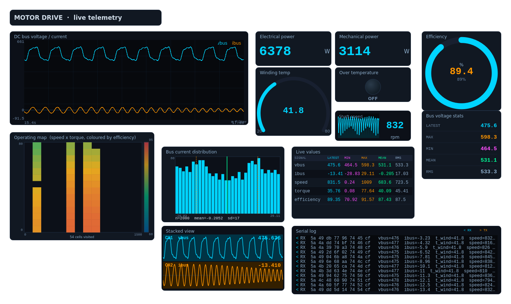
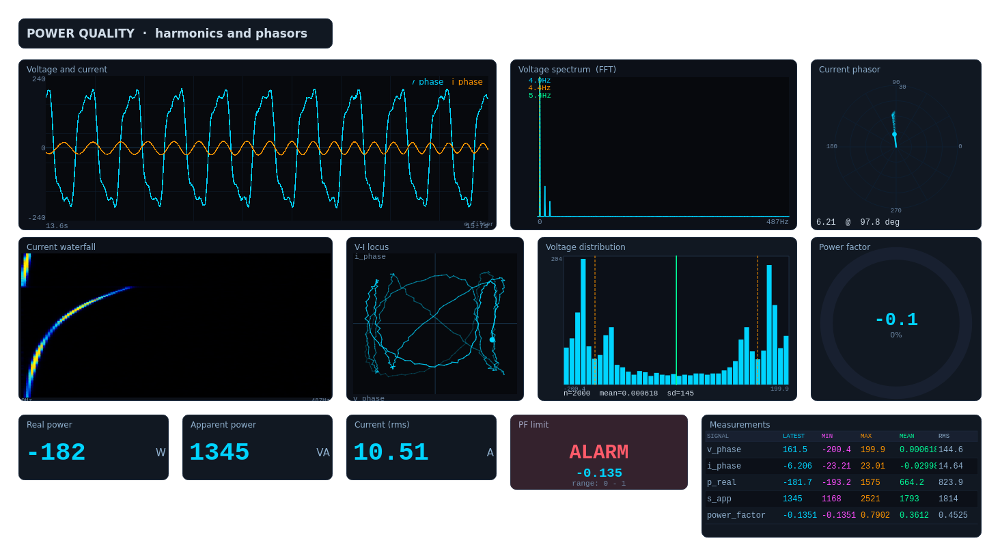
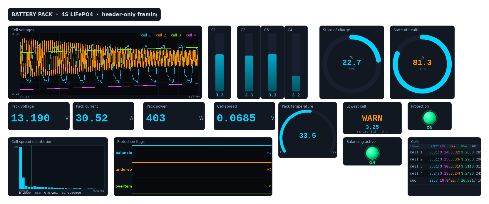
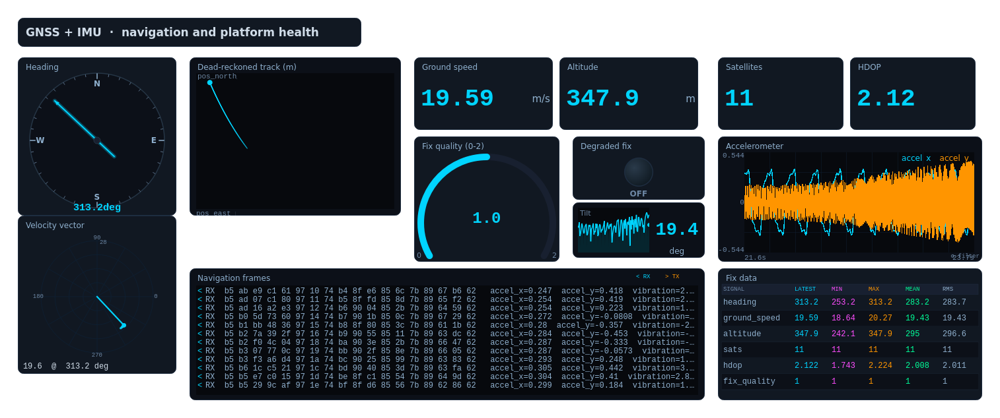
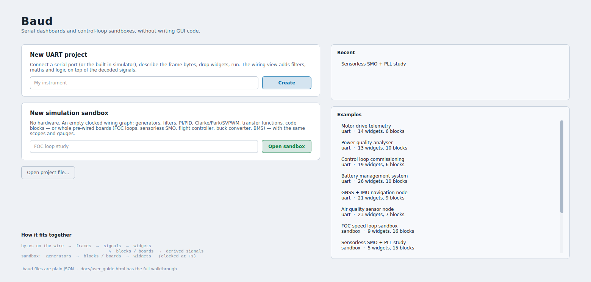
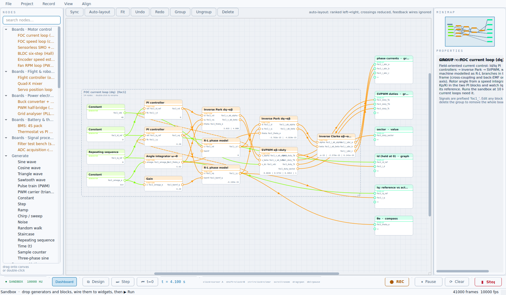
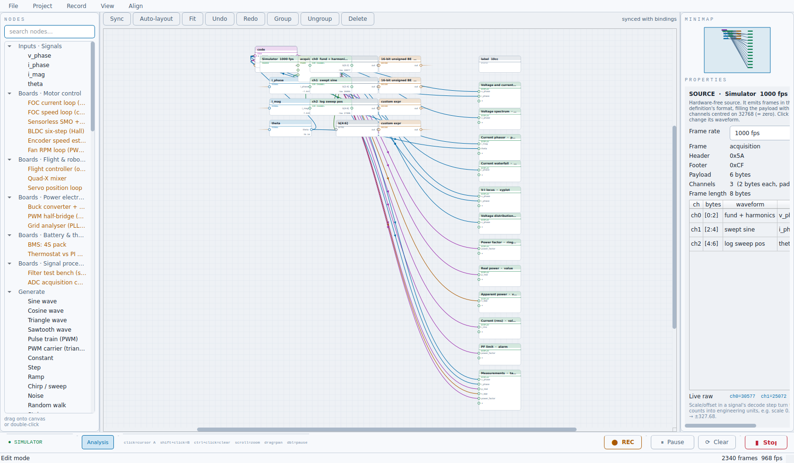
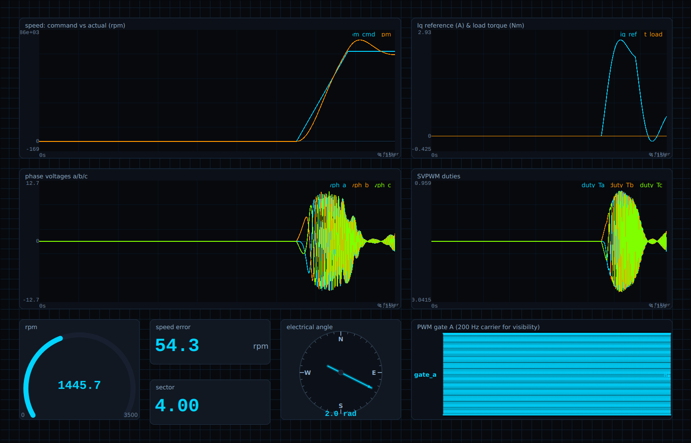
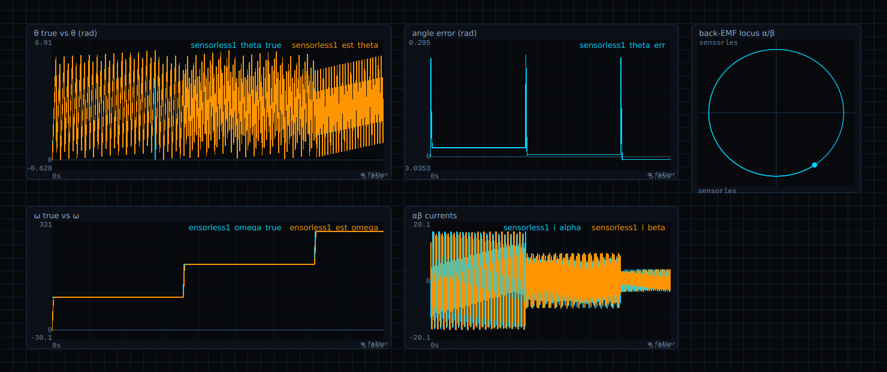
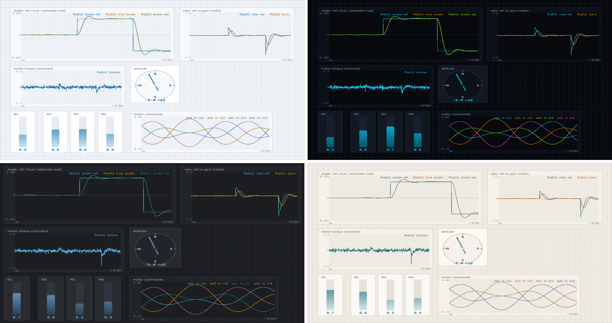

# Baud

**Serial dashboards and control-loop sandboxes, without writing GUI code.**

Point Baud at a serial port, describe where your bytes live, and drop instruments on
a canvas — no GUI code, no rebuild cycle. Or skip the wire entirely: open a
simulation sandbox, drop a pre-wired FOC current loop or a sensorless observer,
and tune it live on the same scopes.

I'm keeping the source private for now, so this repo is just screenshots and
an explanation of what Baud does. If it looks like something you'd want to
try, use, or talk about, I'd genuinely like to hear from you — see the bottom
of this page for how to reach me.

```
UART project:   bytes on the wire → framing → signals → widgets
                                                  │
                                                  └─ blocks / boards → derived signals
                buttons / send field ────────────────────────────────► bytes back out

Sandbox:        generators → blocks / boards → widgets            (clocked at Fs)
```

---

## What it is

Two ways to work, sharing one builder, one widget set, one wiring editor:

- **UART project** — connect a serial port (or the built-in simulator), define
  how header/payload/footer bytes decode into named signals — fixed types with
  scale and offset, or full Python expressions — and bind them to widgets. Send
  values back out with 9 TX encodings. Record to CSV, replay through the same
  dashboard.
- **Simulation sandbox** — no hardware, no frames. An empty clocked wiring
  graph: drop signal generators, filters, PI/PID controllers, Clarke/Park/SVPWM,
  transfer functions, logic and code blocks — or whole **pre-wired boards**
  (an FOC current loop, a sensorless SMO + PLL observer, a flight controller, a
  buck converter, a BMS pack, …) that arrive already wired, with matching
  scopes on the dashboard. Tune a gain while it runs and watch the response
  settle.

Both views stay in sync: a right-click "bind signal" and a drawn wire in the
graph edit the same underlying binding, from either direction.

## Highlights

- **27 widgets** — live graphs, a stacked scope, XY, spectrogram/waterfall,
  FFT, Bode plot, phasor, histogram, an operating map, gauges, LEDs, alarms,
  a heatmap, tables, a serial log, plus knobs, sliders, buttons and a TX send
  field — every one documented with a description in the palette.
- **110 wiring blocks** across generators, math, combine, filter, dynamics,
  control (PI/PID), logic, motor control (Clarke/Park/SVPWM, sliding-mode
  observer, PLL, six-step commutation, encoders) and lookup tables — plus
  user code blocks with `t`, `dt` and persistent state, multi-output blocks,
  and feedback wires for closing a loop.
- **16 pre-wired boards** — FOC current & speed loops, sensorless SMO + PLL,
  BLDC six-step, encoder speed estimation, a fan RPM loop, a one-axis flight
  controller, a quad-X mixer, a servo position loop, a buck converter, a PWM
  half-bridge, a grid analyser, a 4S BMS pack, a thermostat vs. PI heater, a
  filter test bench, an ADC chain. Drop one, choose whether to bring its
  dashboard widgets along, and it's wired.
- **Custom decode in Python** for anything scale-and-offset can't express —
  bit extraction, multi-byte reconstruction, thermistor curves, `log()`,
  conditionals.
- **Simulator, visualised.** Selecting the built-in simulator shows its
  channel plan right in the wiring graph — which bytes each channel fills,
  which signals decode it, a live raw readout — and lets you pick a waveform
  per channel.
- **Four themes** — Daylight (default), Console, Graphite, Paper — all
  WCAG-AA checked, dockable panels, autosave on run.
- **Record & replay**, oscilloscope measurement cursors, per-widget hotkeys,
  a spectrogram, runtime filters (LPF/HPF/AVG/MED/d·dt) on any trace.

## Project files

A project is a single `.baud` file — plain JSON. Framing, signals, every
widget and its bindings, the wiring graph with node positions and block
parameters, the active theme, the panel layout. Diff-friendly in version
control.

---

## Screenshots

### Dashboards (UART, decoded from the built-in simulator)

Bus voltage/current, computed electrical & mechanical power, an efficiency
model, and an operating map — all derived in the wiring editor from two raw
signals.



Live FFT, a current waterfall, a V–I locus, a current phasor with trail, and
real/apparent power computed through function and code blocks.



A 4-cell pack with per-cell voltages, pack spread and protection flags on a
logic-timing view —



— and a GNSS + IMU node: heading, a dead-reckoned track, fix quality from
satellite count and HDOP.



### The start screen

Create a UART project or a simulation sandbox; recent projects and the
bundled examples are one click away.



### Dropping a pre-wired board

The FOC current-loop board, dropped and auto-laid-out: PI controllers on the
d/q axes, an inverse Park → SVPWM chain, an R-L machine model closing the
loop through a feedback wire — every block editable, the palette on the
left, live values on every port.



### The simulator, in the wiring view

Selecting Simulator draws its channel plan directly in the graph — bytes,
waveform, which signals decode it, and a live raw readout.



### Sandbox dashboards — no hardware, just the wiring graph

A cascaded PMSM speed loop: a ramped setpoint, a PI controller, an inverse
Park → SVPWM chain, stepped at 10 kHz.



A sliding-mode back-EMF observer tracking a simulated machine's angle and
speed through a PLL — true vs. estimated, angle error, and the back-EMF
locus.



### Themes

Daylight (default), Console, Graphite, Paper — the same dashboard in each.



---

## Get in touch

I built Baud on my own and I'm not publishing the source publicly right now —
but I'm happy to show it to you, walk through it, or talk about what it'd
take to get you access. Reach out however's easiest:

- **Email:** [suhasvemula98@gmail.com](mailto:suhasvemula98@gmail.com)
- **Discussion thread:** [github.com/Suhas-48/Baud-Showcase/discussions/1](https://github.com/Suhas-48/Baud-Showcase/discussions/1)
- **LinkedIn:** [linkedin.com/in/suhas-vemula-5694b2243](https://www.linkedin.com/in/suhas-vemula-5694b2243/)

Whichever you use, tell me a bit about what you're working on and why Baud
caught your eye — it helps me get back to you with something useful instead
of a generic reply.
